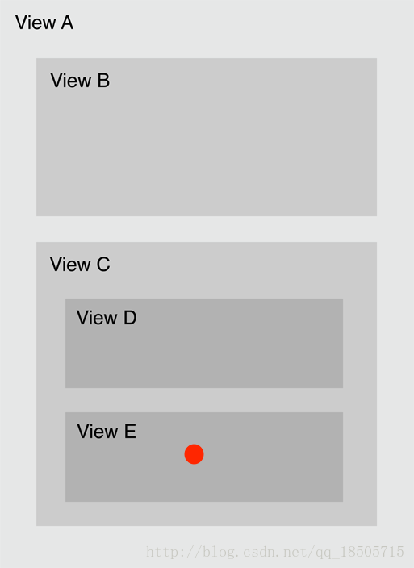
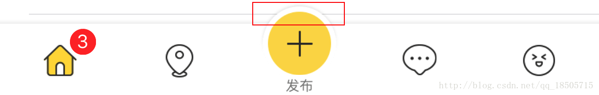

# * _**hitTest是什么**_
    hitTest其实指的就是view的： 
    /**
    point       : 在接收器的局部坐标系(界)中指定的点。
    event       : 系统保证调用此方法的事件。如果从事件处理代码外部调用此方法，则可以指定nil。
    returnValue : 视图对象是当前视图和包含点的最远的后代。如果点完全位于接收方的视图层次结构之外，则返回nil。
    */
    - (UIView*)hitTest:(CGPoint)point withEvent:(UIEvent *)event
# * _**hitTest的调用顺序**_
`touch -> UIApplication -> UIWindow -> UIViewController.view -> subViews -> ....-> 合适的view`

**目的：通过hitTest来找到最合适处理点击时间的view**

常见的视图不响应事件不外乎如下几种情况
1、view.userInteractionEnabled = NO;
2、view.hidden = YES;
3、view.alpha < 0.05
4、view 超出 superview 的 bounds
代码模拟hitTest的原理如下

```
- (UIView*)hitTest:(CGPoint)point withEvent:(UIEvent *)event
{
   // 如果交互未打开，或者透明度小于0.05 或者 视图被隐藏
    if (self.userInteractionEnabled == NO || self.alpha < 0.05 || self.hidden == YES)
    {
       return nil;
    }

    // 如果 touch 的point 在 self 的bounds 内
    if ([self pointInside:point withEvent:event])
    {
       for (UIView *subView in self.subviews)
        {
           //进行坐标转化
            CGPoint coverPoint = [subView convertPoint:point fromView:self];

           // 调用子视图的 hitTest 重复上面的步骤。找到了，返回hitTest view ,没找到返回有自身处理
            UIView *hitTestView = [subView hitTest:coverPoint withEvent:event];
           if (hitTestView)
            {
                return hitTestView;
            }
        }
       return self;
    }
    return nil;
}
```
图解举例如下：


1、首先调用ViewA的hitTest方法，由于触摸点在其范围内，pointInside返回YES，遍历其子视图，依次调用ViewB和ViewC的hitTest方法
2、执行ViewB的hitTest方法，由于触摸点是不在ViewB内，其pointInside方法返回NO，hitTest返回nil
3、执行ViewC的hitTest方法，由于触摸点是在ViewC内，其pointInside方法返回YES，遍历其子视图，依次调用ViewD和ViewE的hitTest方法
4、执行ViewD的hitTest方法，由于触摸点是不在ViewD内，其pointInside方法返回NO，所以其hitTest返回nil
5、执行ViewE的hitTest方法，由于触摸点是在 ViewE内，其pointInside方法返回YES，由于其没有子视图了，其hitTest返回其本身
6、最终，由ViewE来响应该点击事件

# * _**hitTest的运用场景**_
1.事件透传：
 场景需求：viewB和viewC都是viewA的子视图，viewB被viewC全部覆盖，现需要viewB来处理viewC的点击事件
 hitTest解决：只需重写viewC的hitTest方法,当hitTestview == self ，返回nil 即可。这样，事件就别viewB 捕获到。
    
```
- (UIView*)hitTest:(CGPoint)point withEvent:(UIEvent *)event
{
    UIView *hitTestView = [super hitTest:point withEvent:event];
    if (hitTestView == self) 
    {
        return nil;
    }else
    {
        return hitTestView;
    }
}
```
2.子视图超出父视图范围：

场景需求：要让中间按钮响应点击超出TabBar按钮部分的点击事件
解决方法：重写TabBar的hitTest方法，当点击的点在中间按钮区域将按钮返回出去

```
- (UIView *)hitTest:(CGPoint)point withEvent:(UIEvent *)event {


     //将当前tabbar的触摸点转换坐标系，转换到中间按钮的身上，生成一个新的点
     CGPoint newP = [self convertPoint:point toView:self.centerBtn];

      //判断如果这个新的点是在中间按钮身上，那么处理点击事件最合适的view就是中间按钮
      if ( [self.centerBtn pointInside:newP withEvent:event]) 
      {
            return self.centerBtn;
       }

    return [super hitTest:point withEvent:event];
}
```
