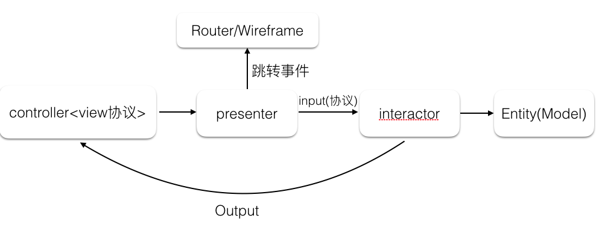

mv**：其实都是为了解决mvc中controller过于臃肿的问题
* mvvm：将controller拆分成，view层和viewmodel层，其实只是将臃肿的逻辑搬移到了viewmodel中
    * viewmodel:负责业务处理，接口请求，数据处理
    * view:负责视图展示，交互，触发更新
* viper：相比于mvvm多出nteractor（交互器）和Router（路由）,如下图
    * View :提供完整的视图，负责视图的组合、布局、更新;向Presenter提供更新视图的接口;将View相关的事件发送给Presenter
    * Presenter:接收并处理来自View的事件;向Interactor请求调用业务逻辑;接收并处理来自Interactor的数据回调事件;通知View进行更新操作;通过Router跳转到其他View 
    * Router:提供View之间的跳转功能，减少了模块间的耦合;初始化VIPER的各个模块
    * Interactor:维护主要的业务逻辑功能，向Presenter提供现有的业务用例;维护、获取、更新Entity(model);当有业务相关的事件发生时，处理事件，并通知Presenter;Entity和Model一样的数据模型
       

    
