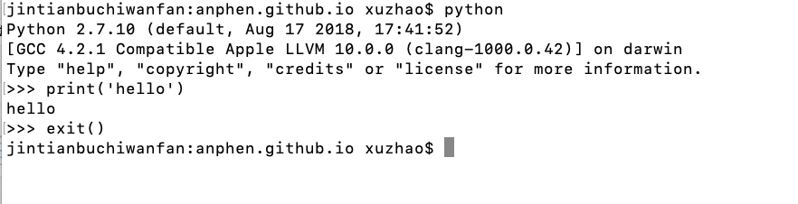

# python安装
`brew install python3`

# python运行
1. 命令行模式：输入python进入命令行模式，然后进行代码编写及运行，exit()退出命令行模式
2. 交互模式:可以执行 *.py 文件 `python *.py`;也可以在py文件所在目录直接使用`./*.py`,不过这种方式要先加权限`chmod a+x *.py `

# python注意
1. `#!/usr/bin/env python3`：这种写法在你机器上安装了多个版本的python的时候有意义，这样声明的时候，会去取你机器的 PATH 中指定的第一个 python 来执行你的脚本。如果这时候你又配置了虚拟环境的话，那么这样写可以保证脚本会使用你虚拟环境中的 python 来执行。`#!/usr/bin/python`：表示写死了就是要 /usr/bin/python 这个目录下 python 来执行你的脚本。这样写程序的可移植性就差了，如果此路径下python命令不存在就会报错。

  

