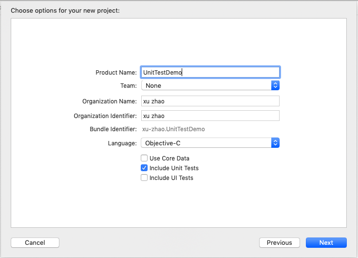
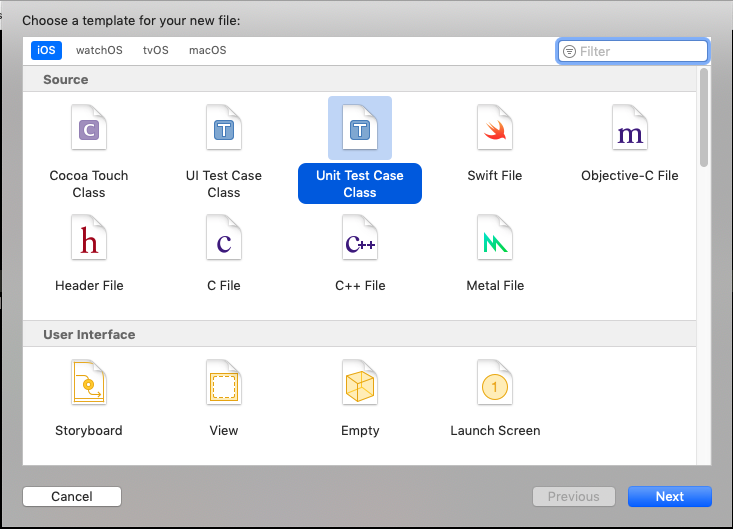

* Xcode7以后的版本中集成了XCTest单元测试框架，我们可以在新建工程的时候直接勾选
    
* 也可以在已有工程新建测试单元，一般以文件Tests结尾
    


-------

单个测试文件里面的组成如下
```
//测试方法调用前调用
- (void)setUp {
    // Put setup code here. This method is called before the invocation of each test method in the class.
}

//测试方法调用后调用
- (void)tearDown {
    // Put teardown code here. This method is called after the invocation of each test method in the class.
}

//测试代码可以写到以test开头的方法中 并且test开头的方法左边会生成一个菱形图标，点击即可运行检测当前test方法内的代码
- (void)testExample {
    // This is an example of a functional test case.
    // Use XCTAssert and related functions to verify your tests produce the correct results.
    
}

//性能测试
- (void)testPerformanceExample {
    // This is an example of a performance test case.
    [self measureBlock:^{
        // Put the code you want to measure the time of here.
    }];
}
```

测试工程中代码测试方式总结
```
- (void)testProductManager{
    
    //相等通过测试，否则打印描述
    XCTAssertEqual([self.manager getDiscountWithType:1], 0.5, @"折扣不是0.5");
    
    //不为nil通过测试，否则打印描述
    XCTAssertNotNil([self.manager getProductSubDesc], @"描述为空");
    
    //为nil通过测试，否则打印描述
    XCTAssertNil([self.manager getProductDesc], @"描述不为空");
    
    //true通过测试，否则打印描述
    XCTAssertTrue([self.manager isTemaiProduct], @"不是特卖商品");
    
    //false通过测试，否则打印描述
    XCTAssertFalse([self.manager isTemaiProduct], @"是特卖商品");

}
```