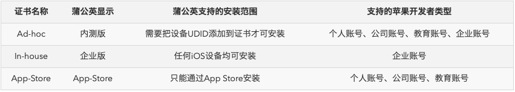

* **99 - 个人**
    1. 此计划是为开发者能够自由地创造iPhone / iPod Touch/ iPad的商业应用，并且能够发布他们的应用程序在App Store上。
    2. **此计划每年有100台测试机器可以设置作开发以及测试用途。**
    3. 这个程序不允许开发人员创建一个团队，团队成员添加到他们的帐户。
    4. 开发者参加这一计划将有各自的名称作为卖方在App商店上市。
* **99美元 - 公司**
    1. 公司应在邓白氏注册并拥有有效的DUNS号码。
    2. 此计划是对于希望开发iPhone / iPod Touch/ iPad的应用程序的公司而设。
    3. **此计划每年有100台测试机器可以设置作开发以及测试用途。**
    4. 这个程序允许开发人员创建一个团队，团队成员添加到他们的帐户。
    5. 参加这一计划，其公司名称将作为卖方在App商店上市。
    6. 备注：
        Admin Legal权限：超级管理员。可以管理开发者和管理app store中的应用；
        Admin权限：管理员，可以管理开发者。添加测试机子和管理团队证书；
        Member权限：是普通开发者。只能下载证书和使用证书；
        No Access权限：没有相应的权限。
    
* **299 - 企业**
    1. 公司应在邓白氏注册并拥有有效的DUNS号码。
    2. 此计划没有100台测试机器的限制。
    3. 此程序所开发的应用只能发给其雇员作内部使用。
    4. 这个程序允许开发人员创建一个团队，团队成员添加到他们的帐户。
    5. 此计划将不会允许该公司在App商店出售他们的应用程序。

到目前为止，苹果为 iOS 应用共提供了三种类型的证书签名方式，每一种都有独特的用途。这三种分别是
1. Ad-hoc
2. In-house
3. App-Store
关于这三种类型的证书，区别如图所示：

