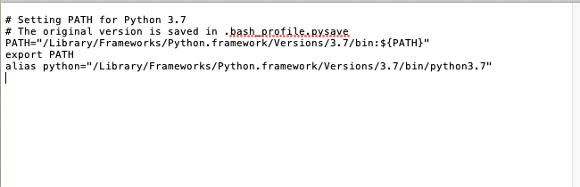
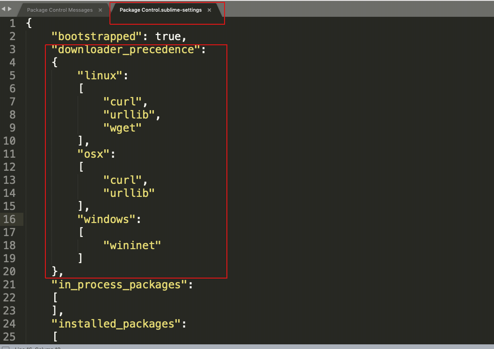

由于安装开发工具，配置开发环境，可能会用到很多命令，我们不仅要会使用，还要明白他们之间的关系

**mac上最常用的命令应该该是brew和gem**
# **brew**
:Homebrew，是==Mac OS X上的软件包管理工具，我们能够通过终端方便的使用它来安装管理苹果没有自带的Unix相关工具软件==,被誉为OS X不可或缺的套件管理器。Homebrew是基于Ruby安装的，==Mac默认自带Ruby==
**安装**
`/usr/bin/ruby -e "$(curl -fsSL https://raw.githubusercontent.com/Homebrew/install/master/install)"`
**常用命令**
`brew search git` ：查找软件包
`brew install git` ：安装软件包
`brew list` ：列举通过Homebrew安装的程序
`brew uninstall git ` ：卸载软件包
`brew info git` ：查看软件包信息**
`brew update` ：更新HomeBrew
`brew outdated` ：列出过时的软件包（已安装但不是最新版本）
`brew upgrade 或 brew upgrade wget` ：更新过时的软件包（全部或指定）

# **Gems**
：RubyGems是一个包管理框架，提供了ruby社区gem的托管服务，用于方便地下载、安装和使用==ruby软件包==。ruby软件包被称为gem，包含了ruby应用或库。要升级到最新的RubyGems,==Mac 自带 gem==
**常用命令**
```
gem sources -l #列出安装源
gem sources -a #添加安装源
gem sources -r #删除安装源 
gem update --system #更新 gem 本身
gem update #更新所有程序包
gem update cocoapods #更新某一程序包
gem environment #查看 gem 安装环境
gem -v #gem版本
gem update #更新所有包
gem update --system #更新RubyGems软件自身
gem install rake #安装rake,从本地或远程服务器
gem install rake --remote #安装rake,从远程服务器
gem install watir -v(或者--version) 1.6.2#指定安装版本的
gem uninstall rake #卸载rake包
gem list d #列出本地以d打头的包
gem query -n ''[0-9]'' --local #查找本地含有数字的包
gem search log --both #从本地和远程服务器上查找含有log字符串的包
gem search log --remoter #只从远程服务器上查找含有log字符串的包
gem search -r log #只从远程服务器上查找含有log字符串的包
gem help #提醒式的帮助
gem help install #列出install命令 帮助
gem help examples #列出gem命令使用一些例子
gem build rake.gemspec #把rake.gemspec编译成rake.gem
gem check -v pkg/rake-0.4.0.gem #检测rake是否有效
gem cleanup #清除所有包旧版本，保留最新版本
gem contents rake #显示rake包中所包含的文件
gem dependency rails -v 0.10.1 #列出与rails相互依赖的包
gem environment #查看gem的环境
```

# **npm**
**node**
**安装**：`brew install node`
:NPM是随同NodeJS一起安装的包管理工具
*  本地安装
1. 将安装包放在 ./node_modules 下（运行 npm 命令时所在的目录），如果没有 node_modules 目录，会在当前执行 npm 命令的目录下生成 node_modules 目录。
2. 可以通过 require() 来引入本地安装的包。
* 全局安装
1. 将安装包放在 /usr/local 下或者你 node 的安装目录。
2. 可以直接在命令行里使用。

**npm常用命令**
```
npm install <Module Name> #npm 命令安装node模块
npm install express          # 本地安装
npm install express -g   # 全局安装
npm list -g #查看所有全局安装的模块
npm list grunt #查看某个模块的版本号
npm uninstall <Module Name>  #卸载模块
npm update <Module Name> #更新模块
npm search <Module Name> #搜索模块
```
**package.json** :package.json 位于模块的目录下，用于定义包的属性

**package.json属性说明**
```
name - 包名。
version - 包的版本号。
description - 包的描述。
homepage - 包的官网 url 。
author - 包的作者姓名。
contributors - 包的其他贡献者姓名。
dependencies - 依赖包列表。如果依赖包没有安装，npm 会自动将依赖包安装在 node_module 目录下。
repository - 包代码存放的地方的类型，可以是 git 或 svn，git 可在 Github 上。
main - main 字段指定了程序的主入口文件，require('moduleName') 就会加载这个文件。这个字段的默认值是模块根目录下面的 index.js。
keywords - 关键字
```

# **pip**
pip 是一个现代的，通用的 Python 包管理工具。提供了对 Python 包的查找、下载、安装、卸载的功能。
* 安装`curl https://bootstrap.pypa.io/get-pip.py | python3`
curl：url是一个利用URL规则在命令行下工作的文件传输工具，可以说是一款很强大的http命令行工具。它支持文件的上传和下载，是综合传输工具，但按传统，习惯称url为下载工具。`语法：# curl [option] [url]`
* 使用

```
Usage:   
  pip <command> [options]

Commands:
  install                     Install packages.
  download                    Download packages.
  uninstall                   Uninstall packages.
  freeze                      Output installed packages in requirements format.
  list                        List installed packages.
  show                        Show information about installed packages.
  check                       Verify installed packages have compatible dependencies.
  config                      Manage local and global configuration.
  search                      Search PyPI for packages.
  wheel                       Build wheels from your requirements.
  hash                        Compute hashes of package archives.
  completion                  A helper command used for command completion.
  help                        Show help for commands.

General Options:
  -h, --help                  Show help.
  --isolated                  Run pip in an isolated mode, ignoring
                              environment variables and user configuration.
  -v, --verbose               Give more output. Option is additive, and can be
                              used up to 3 times.
  -V, --version               Show version and exit.
  -q, --quiet                 Give less output. Option is additive, and can be
                              used up to 3 times (corresponding to WARNING,
                              ERROR, and CRITICAL logging levels).
  --log <path>                Path to a verbose appending log.
  --proxy <proxy>             Specify a proxy in the form
                              [user:passwd@]proxy.server:port.
  --retries <retries>         Maximum number of retries each connection should
                              attempt (default 5 times).
  --timeout <sec>             Set the socket timeout (default 15 seconds).
  --exists-action <action>    Default action when a path already exists:
                              (s)witch, (i)gnore, (w)ipe, (b)ackup, (a)bort).
  --trusted-host <hostname>   Mark this host as trusted, even though it does
                              not have valid or any HTTPS.
  --cert <path>               Path to alternate CA bundle.
  --client-cert <path>        Path to SSL client certificate, a single file
                              containing the private key and the certificate
                              in PEM format.
  --cache-dir <dir>           Store the cache data in <dir>.
  --no-cache-dir              Disable the cache.
  --disable-pip-version-check
                              Don't periodically check PyPI to determine
                              whether a new version of pip is available for
                              download. Implied with --no-index.
  --no-color                  Suppress colored output

```


**Python3安装**
1. 到python官网下载页面下载最新的python版本（或者自己需要的版本）到本地 
2. 下载完成后，打开下载的pkg包按照步骤一路点确定，不需要自己修改任何东西，最后安装完成，安装路径默认为 /Library/Frameworks/Python.framework/Versions/3.7
3. 安装完成，打开电脑自带终端，如果你的终端运行的shell是bash（默认的），可以直接在终端输入`open ~/.bash_profile`,没有这个文件可以先创建`touch .bash_profile`,回车后会自动打开一个文本文件，我们可以直接修改里面的内容.如下图我们只需加上这个alias`alias python="/Library/Frameworks/Python.framework/Versions/3.7/bin/python3.6"`,其实就是在环境变量中配置"python"别名, 
4. 修改完成后command+s保存这个文件内容，然后重新打开终端或者继续执行  `source ~/.bash_profile`,该命令是环境变量立即生效
5. 验证 终端输入python回车，可以看到mac自带python版本已经是我们安装的最新的python版本了
6. 如果想回到mac自带的python版本，只需要像上面那样打开~/.bash_profile，然后注释掉最后的alias，这样就行了。

   
    
#  **sublime package control安装错误解决办法**
当提示`Package Control
Unable to download *. Please view the console for more details.`,解决方法如下


在 Package Control -> Settings-User 中添加
```
"downloader_precedence":
{
	"linux": [ "curl", "urllib", "wget" ],
	"osx": [ "curl", "urllib" ],
	"windows": [ "wininet" ]
},
```
# **yum**
`yum（全称为 Yellow dog Updater, Modified）是一个在Fedora和RedHat以及SUSE中的Shell前端软件包管理器。基於RPM包管理，能够从指定的服务器自动下载RPM包并且安装，可以自动处理依赖性关系，并且一次安装所有依赖的软体包，无须繁琐地一次次下载、安装。yum提供了查找、安装、删除某一个、一组甚至全部软件包的命令，而且命令简洁而又好记。`

```
1 安装
yum install 全部安装
yum install package1 安装指定的安装包package1
yum groupinsall group1 安装程序组group1

2 更新和升级
yum update 全部更新
yum update package1 更新指定程序包package1
yum check-update 检查可更新的程序
yum upgrade package1 升级指定程序包package1
yum groupupdate group1 升级程序组group1

3 查找和显示
yum info package1 显示安装包信息package1
yum list 显示所有已经安装和可以安装的程序包
yum list package1 显示指定程序包安装情况package1
yum groupinfo group1 显示程序组group1信息yum search string 根据关键字string查找安装包

4 删除程序
yum remove &#124; erase package1 删除程序包package1
yum groupremove group1 删除程序组group1
yum deplist package1 查看程序package1依赖情况

5 清除缓存
yum clean packages 清除缓存目录下的软件包
yum clean headers 清除缓存目录下的 headers
yum clean oldheaders 清除缓存目录下旧的 headers
yum clean, yum clean all (= yum clean packages; yum clean oldheaders) 清除缓存目录下的软件包及旧的headers
```


 
